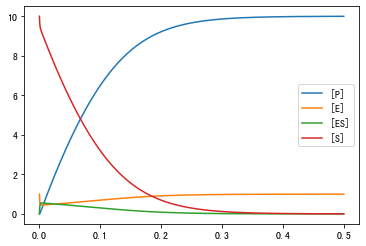
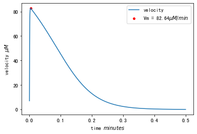

# Report2

## 8.1

Given s = [S], c = [SE], e = [E], and p = [P]

$$\begin{cases}
\frac{ds}{dt} = k_2c+k_1se \\

\frac{de}{dt} =  (k_2 + k_3)c − k_1se\\

\frac{dc}{dt} = k_1se − (k_3 + k_2)c\\

\frac{dp}{dt} = k_3c\\
\end{cases}
$$

## 8.2 

Code
```py
import numpy as np
import math as m
import matplotlib.pyplot as plt

earray=[]
sarray=[]
esarray=[]
parray=[]
tarray=[]

### e denotes E
### s denotes S
### es denotes ES
### p denotes P
### k1,k2,k3 = 100,600,150 

## de/dt = f(e,s,es,p,k1,k2,k3)
def f(e,s,es,p,k1,k2,k3):
    return (k2+k3)*es-k1*s*e

## ds/dt = g(e,s,es,p,k1,k2,k3)
def g(e,s,es,p,k1,k2,k3):
    return k2*es-k1*s*e

## des/dt = h(e,s,es,p,k1,k2,k3)
def h(e,s,es,p,k1,k2,k3):
    return k1*s*e-(k2+k3)*es

## dp/dt = h(e,s,es,p,k1,k2,k3)
def o(e,s,es,p,k1,k2,k3):
    return k3*es


def RK4():
    e = 1
    s = 10
    es = 0
    p = 0
    h_ = 0.0001
    k1,k2,k3 = 100,600,150
    t = 0
    while t<=0.5:
        earray.append(e)
        sarray.append(s)
        esarray.append(es)
        parray.append(p)
        tarray.append(t)
        t+=h_

        #First Step
        f1=f(e,s,es,p,k1,k2,k3) 
        m1=e+f1*h_/2
        g1=g(e,s,es,p,k1,k2,k3)
        n1=s+g1*h_/2
        h1=h(e,s,es,p,k1,k2,k3)
        p1=es+h1*h_/2
        o1=o(e,s,es,p,k1,k2,k3)
        q1=p+o1*h_/2

        #Second Step
        f2=f(m1,n1,p1,q1,k1,k2,k3) 
        m2=e+f2*h_/2
        g2=g(m1,n1,p1,q1,k1,k2,k3)
        n2=s+g2*h_/2
        h2=h(m1,n1,p1,q1,k1,k2,k3)
        p2=es+h2*h_/2
        o2=o(m1,n1,p1,q1,k1,k2,k3)
        q2=p+o2*h_/2

        #Third Step
        f3=f(m2,n2,p2,q2,k1,k2,k3) 
        m3=e+f3*h_
        g3=g(m2,n2,p2,q2,k1,k2,k3)
        n3=s+g3*h_
        h3=h(m2,n2,p2,q2,k1,k2,k3)
        p3=es+h3*h_
        o3=o(m2,n2,p2,q2,k1,k2,k3)
        q3=p+o3*h_

        #Forth Step
        f4=f(m3,n3,p3,q3,k1,k2,k3)
        g4=g(m3,n3,p3,q3,k1,k2,k3)
        h4=h(m3,n3,p3,q3,k1,k2,k3)
        o4=o(m3,n3,p3,q3,k1,k2,k3)

        e=e+(f1+2*f2+2*f3+f4)*h_/6
        s=s+(g1+2*g2+2*g3+g4)*h_/6
        es=es+(h1+2*h2+2*h3+h4)*h_/6
        p=p+(o1+2*o2+2*o3+o4)*h_/6
    return 

def main():
    RK4()
# thr results are the earray[E] sarray[S] esarray[ES] parray[P]

if __name__ == "__main__":
    main()
```

**Fig 1**


Figure 1 shows the curve of [E],[S],[ES],[P] over time.

## 8.3

**Fig 2**


Figure 2 shows the $V_m$ in my plot of velocity

+ Vm = $82.65 \mu M/min$
+ t = 0.0036 $min$